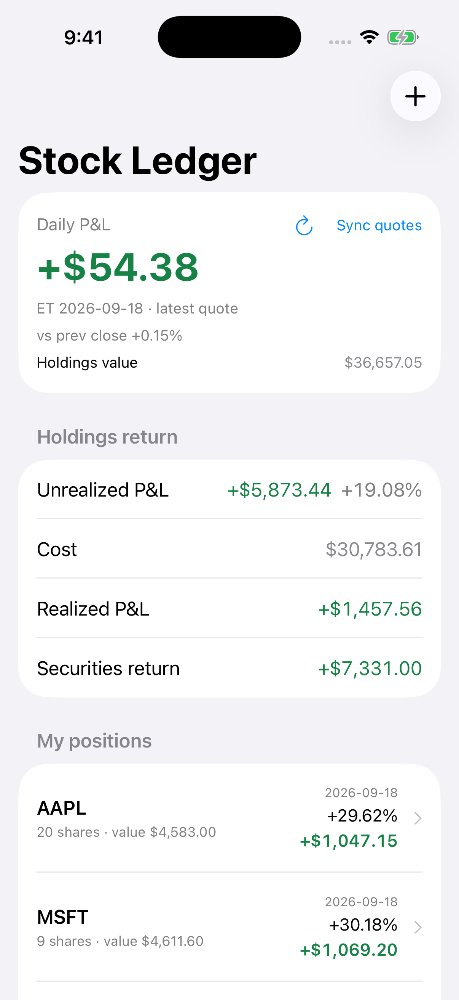
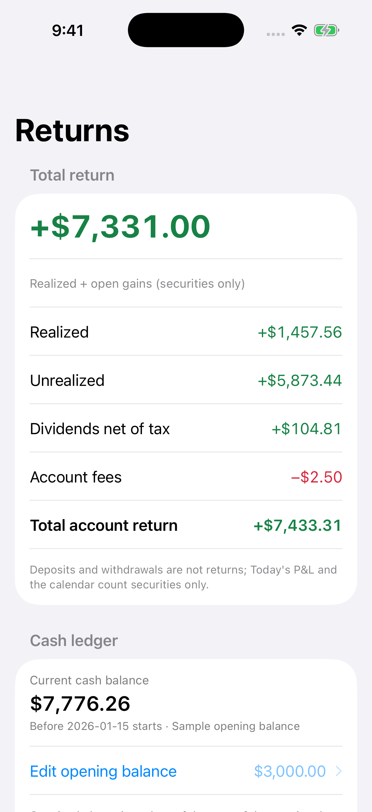
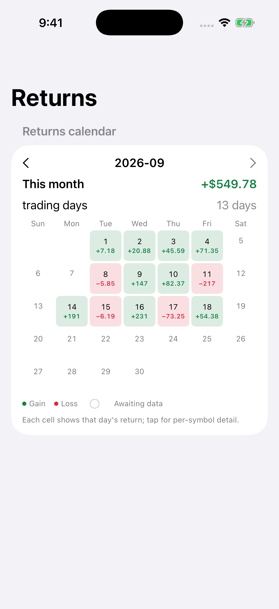
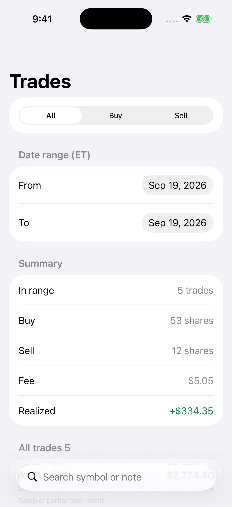
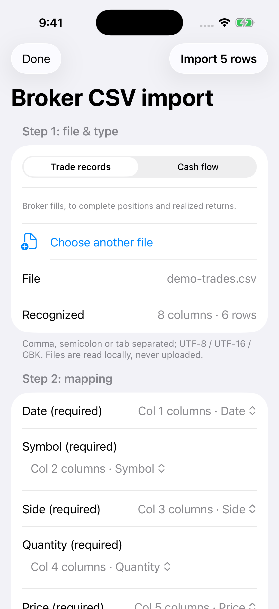
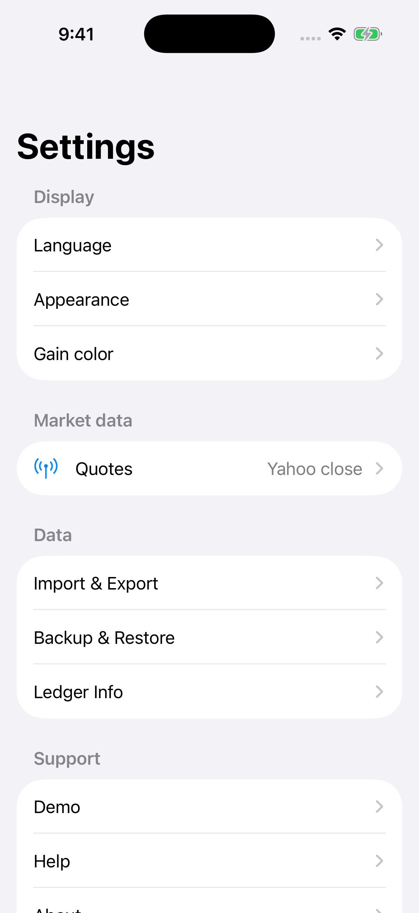
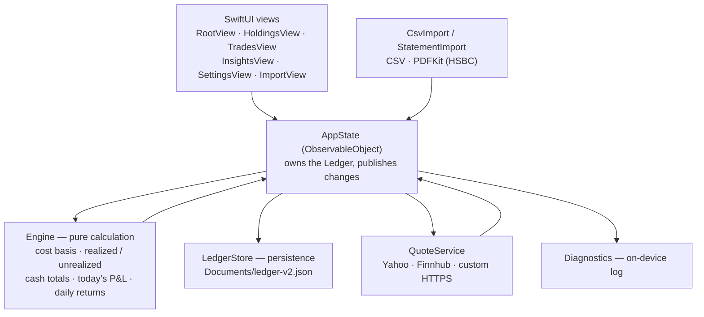

# US Stock Ledger

> A privacy-first portfolio tracking application for recording U.S. stock transactions, monitoring investment performance, and managing portfolio data locally.

<p align="center">
  
</p>

A native SwiftUI app for iPhone. No account, no cloud sync, no analytics: your ledger is one JSON file inside the app's own `Documents` folder, and quote API keys live in the iOS Keychain.

**Current version: native 1.0.1 (build 6)** — iOS 16+. The ledger format is `format: 2`, the stable data baseline since 1.0; the retired web app's version numbers, tags and release notes are kept separate from the native line.

> **中文版见 [README.zh-Hans.md](README.zh-Hans.md)。** / Chinese version: [README.zh-Hans.md](README.zh-Hans.md).

## Demo Video

A short walkthrough: the sample ledger (holdings, returns, daily-return calendar, trades), the HSBC investment-statement import — PDF selection → parser → import preview — and settings.

https://github.com/user-attachments/assets/74133eae-a0a3-4f36-99aa-370a8caa8923

All portfolio data and the HSBC investment statement shown in this demo are synthetic and contain no real customer or account information.

## Features

Broker apps answer "what do I hold?". This one answers the questions an individual investor actually asks:

- **What did I actually pay?** Weighted-average cost across many buys, with fees included.
- **What have I really made?** Realized gains, open gains, dividends (net of withholding) and account fees — kept apart, so deposits and withdrawals are never mistaken for profit.
- **What changed today — and every day since?** Today's P&L against the previous close, a daily-returns calendar, and a cumulative-return curve.
- **Does it match the broker?** Import trade/cash CSVs or HSBC investment-statement PDFs, with a preview before anything is written, so duplicates never sneak in.
- **Where is my cash?** Opening balance, deposits, withdrawals, dividends and fees, with buy/sell cash flow reconciled automatically.

What that means in the app:

- US stocks and ETFs in USD, with fees and notes.
- Holdings: average cost, realized and unrealized return, current value, quote source and quote age.
- Today's P&L: previous close + current price + today's trades and fees. Shows "waiting for data" instead of a fake zero when a quote is missing.
- Cash ledger: opening balance, deposits, withdrawals, manual dividends (with tax) and account fees.
- Daily-return calendar and cumulative-return curve (weekly axis marks and a zero line).
- Quotes from Yahoo daily closes, Finnhub, or a custom HTTPS endpoint.
- Statement import with preview and confirmation: broker trade/cash CSVs and HSBC investment-statement PDFs (PDFKit).
- Backup and restore as a local JSON file, with an export reminder after 30 days.
- Light/dark mode, "green up / red up" color schemes, Dynamic Type and VoiceOver support.
- **Settings**: Display (language, appearance, gain color), Market data (quotes), Data (import & export, backup & restore, ledger info) and Support (demo, help, about) — the home page holds categories and entry points only.
- **Demo Mode**: a complete sample ledger you can explore, and leave again at any time — it never touches your own data.

## Screenshots

Six screens, rendered on an iPhone simulator from the built-in demo ledger (English UI):

| Dashboard (Holdings) | Returns & cash | Daily-return calendar |
| --- | --- | --- |
|  |  |  |

| Trades | Broker CSV import | Settings |
| --- | --- | --- |
|  |  |  |

## Demo

No sign-up and no data required. Open **Settings → Support → Demo** and tap **Try demo ledger** to explore a sample portfolio (trades, dividends, fees and an opening balance); tap **Exit demo mode** when you are ready to enter your own numbers. Demo Mode is isolated: it lives in memory only and never writes into your real ledger.

The demo video is at the top of this README: [Demo Video](#demo-video).

## Architecture

Four layers, one direction. SwiftUI views never calculate anything themselves: they render a derived snapshot that `Engine` computed from the ledger, and every write goes back through `AppState` into a single JSON file.



- **Views** — `RootView`, `HoldingsView`, `TradesView`, `InsightsView`, `SettingsView`, `ImportView`, `StatementImportView` — render and dispatch intents only.
- **`AppState`** owns the `Ledger`, validates mutations, and triggers persistence.
- **`Engine`** is a pure, side-effect-free calculator: weighted-average cost, realized and unrealized gains, cash totals, today's P&L, daily returns and the insights snapshot.
- **`LedgerStore`** reads and writes one versioned JSON file; `Models.swift` holds the Codable model and its validation rules.
- **`QuoteService`** fetches closes, normalizes them and caches them in the ledger. Network failures degrade to "waiting for data" instead of breaking the UI, and API keys are read from the Keychain.
- **`CsvImport` / `HSBCStatement`** parse and validate first, and produce a reviewable `ImportReport` before anything is written.
- **`Diagnostics`** keeps raw system error text out of user-facing messages while still recording it locally.

The three non-obvious data flows:

```text
User → SwiftUI view → AppState → Ledger (validated) → LedgerStore → Documents/ledger-v2.json
                                 ↘ Engine → derived snapshot → SwiftUI view

AppState → QuoteService → Yahoo / Finnhub / custom HTTPS → normalization → Ledger (cached closes)

CSV or PDF → CsvImport / HSBCStatement → per-row validation → preview → AppState → Ledger
```

More detail, including why each decision was made, is in [docs/ARCHITECTURE.md](docs/ARCHITECTURE.md) and [docs/CASE_STUDY.md](docs/CASE_STUDY.md).

### Project layout

```text
ios/App/App/StockLedger/   the native SwiftUI app (models, engine, store, views, importers)
ios/App/App.xcodeproj/     Xcode project
src/  tests/               the legacy web engine and its Vitest suite (build + regression tests)
tests/native/              Swift test suites, compiled and run by scripts/test-native.sh
e2e/                       Playwright end-to-end specs
docs/                      architecture, development, case study, screenshots
scripts/                   native tests, simulator renders, IPA build and IPA verification
releases/                  per-version release notes
```

### Legacy web layer

`src/` is the original TypeScript/Vite implementation. It is still built and still covered by the Vitest and Playwright suites, but it is **not** the shipping UI — the shipped app is the SwiftUI code above — and no new features are added there. It is kept because it is the fastest place to regression-test the ledger maths and the import rules.

## Tech Stack

| Layer | Technology |
| --- | --- |
| App | Swift 5, SwiftUI, iOS 16+ |
| Storage | Local JSON in `Documents` (`ledger-v2.json`); API keys in the iOS Keychain |
| Statements | PDFKit (HSBC investment statement) and a custom CSV parser |
| Networking | `URLSession` against Yahoo Finance, Finnhub, or a custom HTTPS endpoint |
| Legacy web engine | TypeScript, Vite, Capacitor (build and regression tests only) |
| Tests | Vitest (148 cases / 13 files), native Swift suites (429 fixed assertions, plus runtime heartbeat assertions), simulator renders, Playwright (26 cases) |
| CI | GitHub Actions: `checks` on `ubuntu-latest`, iOS build on `macos-26` |
| Tooling | Node 24, pnpm 11, Xcode / `swiftc`, Playwright |

## Testing

Three suites — two cross-platform, the native one macOS-only:

```sh
pnpm test                                # Vitest — 148 cases
bash scripts/test-native.sh              # macOS — native Swift suites, 429 fixed assertions
pnpm e2e                                 # Playwright — 26 cases
```

| Suite | What it locks down |
| --- | --- |
| Vitest (148 cases, 13 files) | Ledger maths, cash ledger, trade ranges, today's P&L, CSV import rules, storage and recovery, localization |
| Native Swift (429 fixed assertions) | The Swift engine against golden ledgers, safety and recovery paths, diagnostics, Demo Mode, CSV import, error paths — plus a 25,000-close / 4,000-session / 1,000-trade load test |
| Simulator renders | The calendar screen and all six README screenshots must actually render demo data; a blank or empty-state PNG fails the run |
| Playwright (26 cases) | Full user journeys against the built app, including "no horizontal overflow" at 320 / 402 / 430 px |

Every push to `main`, `deepseek-dev` or `portfolio/**` — and every pull request — runs the same chain on GitHub Actions, using only scripts that already exist in `package.json`:

```sh
pnpm install --frozen-lockfile
pnpm test     # vitest run
pnpm build    # tsc --noEmit && vite build
pnpm e2e      # playwright test
```

`.github/workflows/checks.yml` runs that chain on `ubuntu-latest` (about a minute). `.github/workflows/build-ios.yml` additionally runs the native Swift suites, the simulator calendar and screenshot renders, and builds the unsigned IPA on `macos-26` (about 14 minutes). The iOS app can only be built on macOS runners, and the artifact is **unsigned** — installing it on a device still needs your own signing identity.

> Markdown-only commits (`**/*.md`) trigger neither workflow; the same is true for pull requests that only touch Markdown.

### Static checks: no ESLint, by design

The project checklist asked CI to run a linter. This repository has **no ESLint, no eslint config and no `lint` script**, and `AGENTS.md` forbids introducing tooling the repository does not already have. CI therefore runs no linter — a deliberate deviation, not an oversight:

- No `lint` script was added, and type checking was **not** renamed into a fake `lint` command.
- Static checking is what `pnpm build` already does: **`tsc --noEmit`** with `strict: true`, covering `src/`, `tests/` and `capacitor.config.ts` (not `e2e/` or the shell scripts).
- If a linter is wanted later, it should be introduced deliberately — dependency, config, and someone accepting the findings — not to tick a checklist box.

## Getting Started

### Install on an iPhone (no coding required)

1. Download `StockLedger-unsigned.ipa` from the latest [release](https://github.com/chengxiaomingcxm/us-stock-ledger/releases).
2. Install a free signing tool such as [Sideloadly](https://sideloadly.io/) or [AltStore](https://altstore.io/) on your computer.
3. Plug in your iPhone, open the tool, drag the IPA in, and sign with your own Apple ID.
4. Keep the bundle identifier `com.personal.stockledger` and use an **update/overlay install** — do **not** uninstall the old version first, or you will lose your ledger.
5. Back up regularly from **Settings → Data → Backup & Restore → Export ledger backup**, and keep the file outside the app.

The IPA is unsigned because it is built without a paid Apple Developer account; the SHA-256 published next to each release lets you verify the file you downloaded.

### Run it from source

```sh
pnpm install --frozen-lockfile

pnpm test                    # Vitest
pnpm build                   # tsc --noEmit && vite build — before e2e: vite preview serves dist/
pnpm e2e                     # Playwright
bash scripts/test-native.sh  # native Swift suites (macOS)

pnpm ios:sync                # copy the built assets into the iOS project
open ios/App/App.xcodeproj   # then run on a simulator or your own device
```

Development happens on `deepseek-dev`, reviewed changes are merged to `main`, and official IPA builds run from `main` only. The macOS-only steps and the release process are documented in [docs/DEVELOPMENT.md](docs/DEVELOPMENT.md).

### Releases

Releases follow semantic versioning (`v1.0.1`, …). Each one publishes an unsigned IPA with its checksum, and per-version notes live in [`releases/`](releases); the running history is [CHANGELOG.md](CHANGELOG.md).

## Data & Privacy

### Where your data lives

- Your ledger is **one JSON file in the app's own `Documents` folder** (`ledger-v2.json`). There is no server, no account and no sync.
- Backups are files **you** export (**Settings → Data → Backup & Restore → Export ledger backup**) and keep wherever you like.
- Deleting the app deletes the ledger. Export a backup before reinstalling.

### What leaves the device

Only quote requests, and only what they need:

- **Yahoo Finance, Finnhub or your own HTTPS endpoint** receive the **ticker symbols** you hold or ask about, so they can return prices. They never receive quantities, cost basis, cash records, prices you entered manually, or backups.
- No analytics, no crash reporting, no advertising SDK, no third-party tracking.
- Technical failures are recorded in a **local** diagnostics log on the device, so the app can show a readable message plus detail you can inspect. It is never uploaded.

### API keys

- Quote API keys are stored in the **iOS Keychain** — not in the JSON ledger — and are never included in a backup export.
- The repository contains no API key, token, secret or personal account information, in the working tree **or anywhere in its git history**. Before this work was published, the full history was scanned for private-key blocks, `API_KEY` / `SECRET` / `TOKEN` / `PASSWORD` / `PRIVATE_KEY` patterns and credential-shaped files; every match was documentation text, a test placeholder, the Keychain constant, or `${{ github.token }}`.
- If you fork this project, keep it that way: keys belong in the Keychain (or a git-ignored local file), never in a tracked one.

## Limitations

Stated plainly, so nobody has to discover them:

- **US equities and ETFs in USD only.** No multi-currency FX, so a non-USD instrument is out of scope.
- **No options, futures or short selling.** Long cash positions only.
- **No broker synchronisation.** Trades and cash records come from manual entry or statement import; there is no live brokerage API connection.
- **No automatic corporate-action processing.** Splits are recorded through the split-event model; dividends are entered manually or imported.
- **Quotes are end-of-day oriented.** Daily closes are the first-class data; intraday manual quotes are supported but this is not a streaming feed.
- **iOS 16+ only.**
- **English and Simplified Chinese** UI strings; some edge-case strings are still English-only.

None of these are bugs — they are the current scope.

## Roadmap

**Current**

- [x] Portfolio tracking — cost basis, realized and unrealized return, cash
- [x] Transaction management
- [x] Performance analytics — today's P&L, daily-returns calendar, cumulative curve
- [x] Statement import — broker CSV, HSBC PDF
- [x] Backup and restore
- [x] Automated testing (Vitest, native Swift, simulator renders, Playwright) and CI

**Portfolio Polish (this round)**

- [x] Demo Mode
- [x] Screenshot showcase
- [x] Architecture, development and case-study documentation
- [x] Demo video
- [ ] Release hardening

**Future / optional**

- [ ] Additional broker import formats
- [ ] Accessibility improvements
- [ ] Localization improvements

Options trading, AI trading and broker automation are explicitly **not** on the roadmap.

## Disclaimer

> US Stock Ledger is a portfolio tracking and record-keeping tool. It does not provide investment advice, trading recommendations, or brokerage services.

Prices come from third-party providers and can be wrong, delayed or missing; always check your broker's statement for anything that matters.

## License

[MIT](LICENSE) © 2026 chengxiaomingcxm
