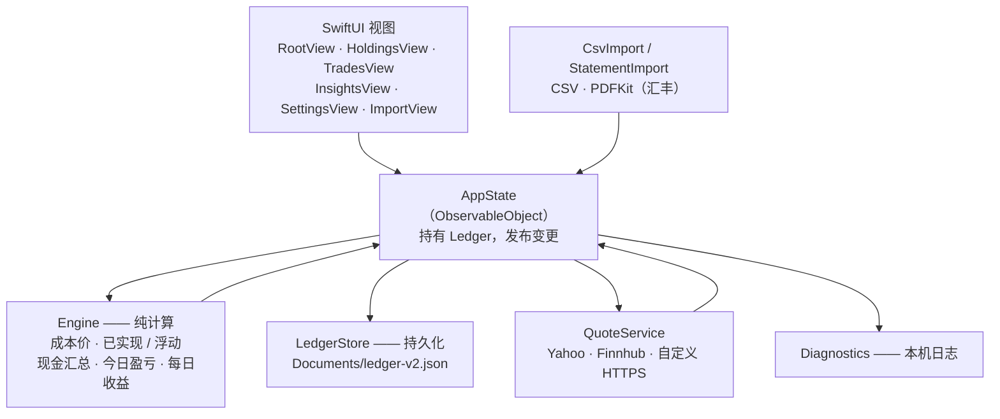

# US Stock Ledger

> 一款隐私优先的美股记账与投资表现追踪应用：在本机记录美股交易、跟踪投资表现，全部数据保存在你自己的设备上。

<p align="center">
  
</p>

原生 SwiftUI iPhone App。不用注册账号、不连云同步、不埋点统计：账本就是 App 自己 `Documents` 目录下的一个 JSON 文件，行情 API Key 存在 iOS 钥匙串里。

**当前版本：1.0.1（build 6）**，支持 iOS 16 及以上。原生 1.0 是产品基线；已下线的旧 Web 版的版本号、标签和发布记录与原生版分开看。

> **English 主 README：[README.md](README.md)。** This is the Chinese version; see [README.md](README.md) for the English main readme.

## 功能

券商 App 回答「我持有什么」，这个 App 回答个人投资者真正关心的问题：

- **我到底花了多少钱？** 多笔买入按加权平均成本计，手续费算进成本。
- **我到底赚了多少？** 已实现收益、浮动收益、分红（扣税）、账户费用分开算，入金和出金绝不计成盈亏。
- **今天、以及每一天涨跌多少？** 今日盈亏对照上一收盘，加上每日收益日历和累计收益曲线。
- **和券商对得上吗？** 导入券商交易/资金 CSV 或汇丰投资结单 PDF，先预览再写入，重复记录不会漏进账。
- **我的现金在哪？** 期初余额、入金、出金、分红、费用，买卖现金流自动联动核对。

落到界面上就是：

- 美元美股、ETF 的买卖、手续费和备注。
- 持仓：平均成本、已实现与浮动收益、当前市值、报价来源与新旧。
- 今日盈亏：上一收盘 + 当前价格 + 当日买卖和手续费；缺行情显示「待补全」，不以零代替。
- 现金账本：期初余额、入金、出金、手动分红（含税费）和账户费用。
- 每日收益日历和累计收益曲线（每周刻度 + 零轴）。
- 行情来源：Yahoo 日线收盘、Finnhub 或自定义 HTTPS 接口。
- 导入带预览确认：券商交易/资金 CSV 和汇丰投资结单 PDF（PDFKit）。
- 本地 JSON 备份与恢复；超过 30 天未备份有提醒。
- 深/浅色、红涨绿跌／绿涨红跌、动态字体和 VoiceOver。
- **设置**：显示（语言、外观、涨跌颜色）、行情数据（行情来源）、数据（导入与导出、备份与恢复、账本信息）、支持（示例、帮助、关于）——首页只做分类与入口。
- **示例模式（Demo Mode）**：一套完整示例账本，随时可以退出，绝不碰你自己的数据。

## 截图

六屏，全部用内置示例账本在 iPhone 模拟器上真实渲染（英文界面）：

| 持仓首页 | 收益与现金 | 每日收益日历 |
| --- | --- | --- |
|  |  |  |

| 交易 | 券商 CSV 导入 | 设置 |
| --- | --- | --- |
|  |  |  |

## 示例模式

无需注册、无需数据。打开 **设置 → 支持 → 示例** 后点 **试用示例账本** 就能浏览一套示例持仓（买卖、分红、费用、期初余额），准备录自己的数据时点 **退出示例模式**。示例模式是隔离的：只存在于内存，绝不会写进你的真实账本。

### 演示视频（规划中）

计划录制一段 60–90 秒的作品展示视频并嵌入这里 —— 启动 → 示例 → 持仓首页 → 持仓 → 记一笔 → 收益日历 → 导入 → 设置。是展示片，不是教程。

## 架构

四层、单向：SwiftUI 视图自己不做计算 —— 它们只渲染 `Engine` 从账本算出来的快照，而每一次写入都经 `AppState` 落回同一个 JSON 文件。



- **视图层**：`RootView`、`HoldingsView`、`TradesView`、`InsightsView`、`SettingsView`、`ImportView`、`StatementImportView`，只负责渲染和抛出意图。
- **`AppState`**：持有 `Ledger`，校验修改，并触发持久化。
- **`Engine`**：纯函数、无副作用 —— 加权平均成本、已实现与浮动收益、现金汇总、今日盈亏、每日收益率、收益快照。
- **`LedgerStore`**：读写单一带版本号的 JSON 文件；`Models.swift` 放 Codable 模型与校验规则。
- **`QuoteService`**：拉收盘价、归一化、写回账本缓存。网络出错时降级成「待补全」，而不是把界面弄崩；API Key 从钥匙串读。
- **`CsvImport` / `HSBCStatement`**：先解析校验，产出一份可复核的 `ImportReport`，之后才写入。
- **`Diagnostics`**：把系统原始错误文本挡在用户可见文案之外，同时在本机记录下来。

三条不那么直观的数据流：

```text
用户 → SwiftUI 视图 → AppState → Ledger（已校验）→ LedgerStore → Documents/ledger-v2.json
                                 ↘ Engine → 派生快照 → SwiftUI 视图

AppState → QuoteService → Yahoo / Finnhub / 自定义 HTTPS → 归一化 → Ledger（缓存收盘价）

CSV 或 PDF → CsvImport / HSBCStatement → 逐行校验 → 预览 → AppState → Ledger
```

更详细的架构说明与「为什么这么选」在 [docs/ARCHITECTURE.md](docs/ARCHITECTURE.md) 与 [docs/CASE_STUDY.md](docs/CASE_STUDY.md)。

### 目录结构

```text
ios/App/App/StockLedger/   原生 SwiftUI App（模型 / Engine / Store / 视图 / 导入器）
ios/App/App.xcodeproj/     Xcode 工程
src/  tests/               旧网页引擎及其 Vitest 测试（构建 + 回归用）
tests/native/              Swift 测试套件，由 scripts/test-native.sh 编译并运行
e2e/                       Playwright 端到端用例
docs/                      架构、开发、案例、截图
scripts/                   原生测试、模拟器渲染、IPA 构建与校验
releases/                  各版本发布说明
```

### 旧网页引擎

`src/` 是最早的 TypeScript/Vite 实现。它仍会被构建、也仍由 Vitest 与 Playwright 覆盖，但**它不是现在的界面** —— 出货的是上面的 SwiftUI App —— 也不往那里加新功能。保留它的理由是：它跑账本数学和导入规则回归最快。

## 技术栈

| 层 | 技术 |
| --- | --- |
| App | Swift 5、SwiftUI、iOS 16+ |
| 存储 | `Documents` 本地 JSON（`ledger-v2.json`）；API Key 存 iOS 钥匙串 |
| 结单 | PDFKit（汇丰投资结单）与自写 CSV 解析器 |
| 网络 | `URLSession` 调 Yahoo Finance、Finnhub 或自定义 HTTPS 接口 |
| 旧网页引擎 | TypeScript、Vite、Capacitor（仅构建与回归测试） |
| 测试 | Vitest（148 项 / 13 文件）、Swift 原生套件（413 条断言，另有运行时心跳断言）、模拟器渲染、Playwright（26 项） |
| CI | GitHub Actions：`checks` 跑 `ubuntu-latest`，iOS 构建跑 `macos-26` |
| 工具链 | Node 24、pnpm 11、Xcode / `swiftc`、Playwright |

## 测试

三套，clone 下来都能跑：

```sh
pnpm test                                # Vitest —— 148 项
bash scripts/test-native.sh              # macOS —— Swift 原生套件，413 条断言
pnpm e2e                                 # Playwright —— 26 项
```

| 套件 | 锁住什么 |
| --- | --- |
| Vitest（148 项 / 13 文件） | 账本数学、现金账本、交易区间、今日盈亏、CSV 导入规则、存储与恢复、本地化 |
| Swift 原生（413 条断言） | Swift 引擎对 golden 账本、安全与恢复路径、诊断、示例模式、CSV 导入、错误路径，外加 25,000 收盘价 / 4,000 交易日 / 1,000 笔交易的负载测试 |
| 模拟器渲染 | 日历屏与六张 README 截图必须真的渲染出示例数据；空白或空态截图直接判失败 |
| Playwright（26 项） | 真实用户路径，含 320 / 402 / 430px 下「无横向溢出」 |

推 `main` / `deepseek-dev` / `portfolio/**`，以及**任何 PR**，都会在 GitHub Actions 上跑同一套检查 —— 全部复用 `package.json` 里已有的 script，没有为 CI 另造新命令：

```sh
pnpm install --frozen-lockfile
pnpm test     # vitest run
pnpm build    # tsc --noEmit && vite build
pnpm e2e      # playwright test
```

`.github/workflows/checks.yml` 在 `ubuntu-latest` 上跑上面这条链（约 1 分钟）；`.github/workflows/build-ios.yml` 另外在 `macos-26` 上跑 Swift 原生套件、模拟器日历与截图渲染、并构建未签名 IPA（约 14 分钟）。iOS 只能在 macOS runner 上构建，而且产物是**未签名**的 —— 要装到真机仍需你自己的签名身份。

> 只改 Markdown（`**/*.md`）的提交不会触发这两个工作流，只改 Markdown 的 PR 同理。

### 静态检查：有意不引入 ESLint

任务清单要求 CI 跑 Lint。本仓库**没有 ESLint、没有 eslint 配置、也没有 `lint` script**，`AGENTS.md` 明确禁止在仓库本就不存在的情况下自行引入这类工具。所以 CI 不跑 Linter —— 这是**有意偏离，不是遗漏**：

- `package.json` 没有新增 `lint` script，也**没有**把类型检查改名叫假的 `lint`。
- 静态检查就是 `pnpm build` 已经在做的 **`tsc --noEmit`**（`strict: true`，覆盖 `src/`、`tests/` 与 `capacitor.config.ts`；不覆盖 `e2e/` 与 shell 脚本）。
- 将来若要引入 Linter，应当单独决策（依赖 + 配置 + 人对接下新报出的问题），而不是为了勾选清单。

## 快速开始

### 安装到 iPhone（不懂代码也能装）

1. 从最新 [Release](https://github.com/chengxiaomingcxm/us-stock-ledger/releases) 下载 `StockLedger-unsigned.ipa`。
2. 在电脑上装一个免费签名工具，例如 [Sideloadly](https://sideloadly.io/) 或 [AltStore](https://altstore.io/)。
3. 连上 iPhone，打开工具，把 IPA 拖进去，用你自己的 Apple ID 签名。
4. 保持应用标识 `com.personal.stockledger`，选**覆盖安装** —— 不要先卸载旧版，否则会丢账本。
5. 定期在 **设置 → 数据 → 备份与恢复 → 导出账本备份** 备份，文件存到应用之外。

IPA 未签名，因为没有付费的 Apple 开发者账号；每个 Release 旁边公布 SHA-256，可核对下载文件。

### 从源码跑起来

```sh
pnpm install --frozen-lockfile

pnpm test                    # Vitest
pnpm e2e                     # Playwright
bash scripts/test-native.sh  # Swift 原生套件（macOS）

pnpm build                   # tsc --noEmit && vite build
pnpm ios:sync                # 把构建产物同步进 iOS 工程
open ios/App/App.xcodeproj   # 然后在模拟器或自己的真机上运行
```

开发在 `deepseek-dev` 上进行；审核通过后合并到 `main`，正式 IPA 只从 `main` 构建。只能在 macOS 上跑的步骤和发布流程写在 [docs/DEVELOPMENT.md](docs/DEVELOPMENT.md)。

### 版本发布

用正式语义化版本号（`v1.0.1`…）。每个版本发布未签名 IPA 与校验和，逐版本说明放在 [`releases/`](releases)，变更历史见 [CHANGELOG.md](CHANGELOG.md)。

## 数据与隐私

### 数据存在哪

- 账本是 **App 自己 `Documents` 目录下的一个 JSON 文件**（`ledger-v2.json`）。没有服务器、没有账号、不连云。
- 备份是**你自己**导出的文件（**设置 → 数据 → 备份与恢复 → 导出账本备份**），存哪由你决定。
- 删除 App 就等于删除账本。重装前先导出备份。

### 什么会离开设备

只有行情请求，而且只带它必需的东西：

- **Yahoo Finance、Finnhub 或你自己的 HTTPS 接口**只会收到你持有（或你主动查询）的**股票代码**，用来返回价格。它们不会收到数量、成本、现金记录、手动录入的价格，也不会收到备份。
- 没有埋点统计、没有崩溃上报、没有广告 SDK、没有第三方追踪。
- 技术失败会记在**设备本地**的诊断日志里，这样界面能给出可读文案，同时保留你能查的细节。日志不会上传。

### API Key

- 行情 API Key 存在 **iOS 钥匙串**里 —— 不在 JSON 账本里 —— 也不会进备份导出。
- 仓库里没有 API Key、Token、Secret 或任何个人账户信息，工作区**和整个 git 历史**里都没有。发布前对全历史做了扫描：私钥块、`API_KEY` / `SECRET` / `TOKEN` / `PASSWORD` / `PRIVATE_KEY` 模式，以及凭据类文件名；命中项全是文档文字、测试占位符、钥匙串常量或 `${{ github.token }}`。
- 如果你 fork 这个项目，请保持这一点：Key 属于钥匙串（或被 git 忽略的本地文件），不属于被跟踪的文件。

## 当前限制

如实列出，免得别人自己去踩：

- **只支持美元美股与 ETF。** 不做多币种换算，非美元标的不在范围内。
- **不支持期权、期货、做空。** 只支持现金多头持仓。
- **不连接券商同步。** 交易与资金记录来自手动录入或结单导入，没有实时券商 API 对接。
- **不自动处理公司行动。** 拆股通过拆股事件模型录入；分红手动录入或导入。
- **行情以收盘价为主。** 日线收盘是第一等数据；支持手动录入盘中价，但不是实时行情流。
- **只支持 iOS 16+。**
- 界面文案**英文与简体中文**，个别边角文案仍只有英文。

这些都不是 Bug，是当前的 Scope。

## Roadmap

**已完成**

- [x] 持仓跟踪 —— 成本价、已实现与浮动收益、现金
- [x] 交易管理
- [x] 表现分析 —— 今日盈亏、每日收益日历、累计曲线
- [x] 结单导入 —— 券商 CSV、汇丰 PDF
- [x] 备份与恢复
- [x] 自动化测试（Vitest、Swift 原生、模拟器渲染、Playwright）与 CI

**Portfolio Polish（本轮）**

- [x] 示例模式
- [x] 截图展示
- [x] 架构 / 开发 / 案例文档
- [ ] 演示视频（60–90 秒）
- [ ] 发布加固

**将来 / 可选**

- [ ] 更多券商导入格式
- [ ] 无障碍改进
- [ ] 本地化补全

期权、AI 交易、券商自动下单**明确不在** Roadmap 上。

## 免责声明

> US Stock Ledger is a portfolio tracking and record-keeping tool. It does not provide investment advice, trading recommendations, or brokerage services.

价格来自第三方，可能出错、延迟或缺失；要紧的账目请以券商结单为准。

## 许可

[MIT](LICENSE) © 2026 chengxiaomingcxm
