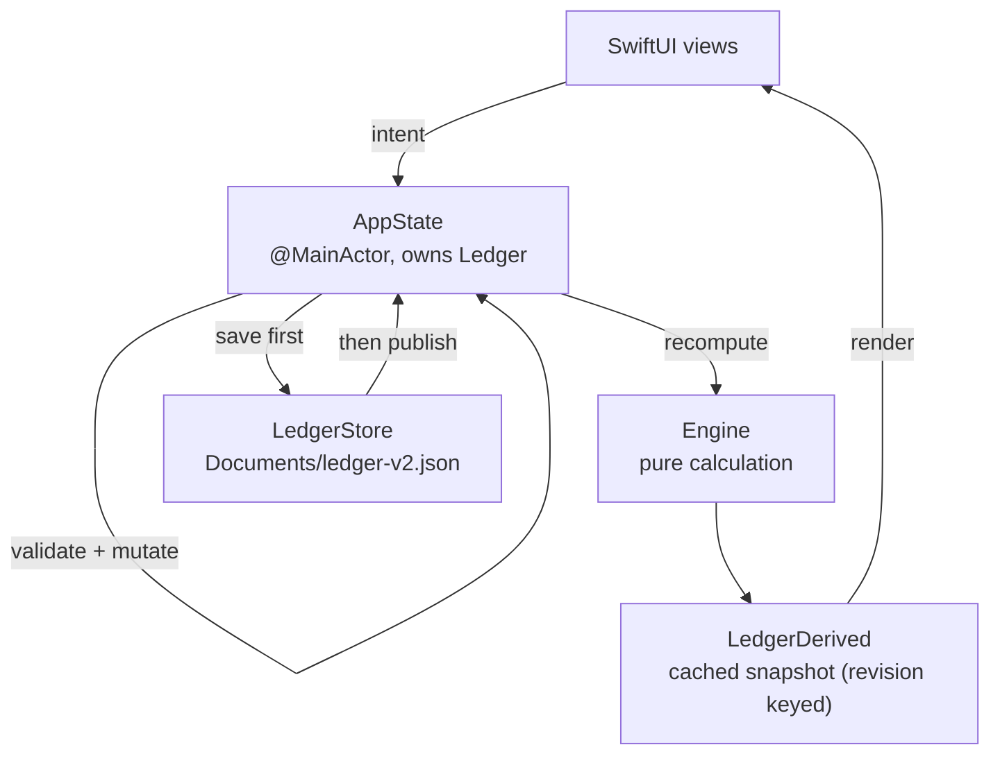

# Architecture

> Goal: a developer should understand this project in about five minutes.
> Everything below is taken from the current code; file names are the real ones.

## System Overview

One repository, two runtimes. Only the first one is the product.

```text
User → SwiftUI app (iOS 16+)          ← the shipping product
         ios/App/App/StockLedger/*.swift
         ├── Documents/ledger-v2.json   the ledger
         └── iOS Keychain               quote API keys

       Legacy web engine (TypeScript + Vite)
         src/*.ts → dist/ → cap sync ios
         still built, still bundled into the IPA, no longer the UI
```

The native app and the legacy web engine are **two independent implementations**. They share concepts and accounting rules, not code. The web engine is kept because it is the fastest place to regression-test the ledger maths and the import rules, and because the Playwright suite drives it.

| Layer | Technology | Location |
| --- | --- | --- |
| UI | SwiftUI, `TabView` with four `NavigationStack`s | `RootView.swift`, `HoldingsView.swift`, `TradesView.swift`, `InsightsView.swift`, `SettingsView.swift`, `ImportView.swift`, `StatementImportView.swift`, `QuoteSettingsView.swift` |
| Application | `@MainActor final class AppState` — the only write path | `Store.swift` |
| Calculation | `enum Engine` — pure functions, no I/O | `Engine.swift` |
| Presentation cache | `LedgerDerived`, precomputed and reused while its `revision` is unchanged | `Engine.swift`, `Store.swift` |
| Persistence | `enum LedgerStore` → `Documents/ledger-v2.json`, `JSONEncoder` with `.atomic` | `Store.swift` |
| Secrets | iOS Keychain (`kSecClassGenericPassword`) | `QuoteService.swift` |
| Market data | `QuoteService` + `MarketClock` (US Eastern) | `QuoteService.swift` |
| Import | `CsvImport` (text), `HSBCStatement` + `StatementImport` (PDFKit) | `CsvImport.swift`, `HSBCStatement.swift`, `StatementImport.swift` |
| Support | `Diagnostics`, `L10n`, `DemoData`, `Models` | same folder |

Entry point: `SceneDelegate.swift` installs `UIHostingController(rootView: RootView().environmentObject(AppState()))`.

### Invariants the code deliberately enforces

These are the rules that make the numbers trustworthy, and tests exist for each of them:

1. **All money is `Decimal`, never `Double`.** Quantities, prices, fees, cash and derived totals are all `Decimal` in the Swift model.
2. **A missing quote is never zero.** Screens show "waiting for data" and summaries report `nil` rather than inventing a price.
3. **Disk first, then memory.** A save writes the file and only then updates in-memory state, so a failed write cannot leave the app believing data was stored.
4. **Imports validate the whole batch before writing anything.** The user reviews an `ImportReport` (valid / skipped / duplicate / error per row) and nothing is committed until they confirm.
5. **Deposits and withdrawals are never profit.** They move cash and cost basis, and are excluded from every P&L figure.
6. **Demo Mode is isolated.** It uses its own state and never writes into the real ledger.

## Data Flow

### Ledger write path



`Engine` is a pure function of `(ledger, quotes, settings)`. `LedgerDerived` is precomputed off the main thread and reused until the ledger's `revision` changes, so scrolling a large history does not recompute the portfolio.

### Market data

```text
AppState → QuoteService → Yahoo Finance / Finnhub / custom HTTPS
                        → normalization (close, previous close, currency)
                        → cached in the ledger → Engine → UI
```

Failure handling is part of the flow, not an afterthought: a network error never clears an existing quote, and the UI distinguishes "no quote yet" from "quote is stale" by showing the quote's own date and source.

### Import

```text
CSV or PDF
   ↓  CsvImport.parse / HSBCStatement.text
raw rows
   ↓  field mapping (broker-specific → TradeField / CashField)
   ↓  per-row validation (number format, sign, required fields)
   ↓  duplicate detection against the existing ledger
ImportReport (valid / skipped / duplicate / error)
   ↓  user confirms in ImportView / StatementImportView
AppState → Ledger → LedgerStore
```

Nothing is written before confirmation, which is what makes "import twice by accident" a non-event.

## Storage Format

`Documents/ledger-v2.json` is a single JSON document holding:

- trades (symbol, side, quantity, price, fee, date, note, broker settlement amount)
- cash records (opening balance, deposit, withdrawal, dividend with tax, fee)
- quote cache (per symbol: close, previous close, date, source)
- price history and split events

The **file name carries the format generation** (`ledger-v2.json`), and the file itself also carries `format: 2` (`Ledger.currentFormat`), which `LedgerStore.decode` enforces on both the load path and the backup-restore path: a file declaring a *higher* format is refused (write protection, "update the app") instead of being decoded into a field-dropping ledger and then overwritten. Format 2 is the **1.0 data baseline**: the format has not changed since, so upgrading never clears anyone's data and ledgers/backups written from 1.0 onwards keep loading. Pre-1.0 beta ledgers and old web-app backups are **not** compatibility targets — they are neither migrated nor specially interpreted — and the app documents that plainly.

`.atomic` writes mean a crash mid-save leaves either the old file or the new one, never a half-written one.

## Error Model

Two channels, deliberately separated:

- **User-facing**: human-readable, localized messages ("This file has no recognizable trade rows.").
- **Technical**: the raw system error, kept in the on-device diagnostics log (`Diagnostics.swift`) and reachable from Settings.

`Diagnostics` never uploads anything — it is a local ring buffer meant to make a bug report possible without leaking implementation detail into the UI.

## Test Architecture

```text
tests/*.test.ts        Vitest      — web engine: ledger maths, cash, import rules, storage
tests/native/*.swift   swiftc      — the real Swift engine: golden ledgers, safety, diagnostics,
                                     demo mode, CSV import, error paths
tests/native/ScreenshotsApp.swift   render harness: real app state → PNG, asserted non-blank
e2e/*.spec.ts          Playwright  — user journeys in the web build, incl. layout overflow checks
```

The native suites are compiled by `scripts/test-native.sh` from an **explicit file list**. That is intentional but sharp-edged: a Swift file that is not on that list is simply not compiled, and the suite still prints a pass. The same file must also be registered in four places in `App.xcodeproj/project.pbxproj` for the real app build. Both are documented in `AGENTS.md` because missing either one has produced a green-locally, red-in-CI commit before.

## Deliberate Non-Goals

The architecture does not try to be a trading platform:

- no order placement, no brokerage connection;
- no multi-currency FX, no options, no short selling;
- no server, no account system, no cloud sync;
- no client-side framework migration: the web engine is frozen, not extended.
